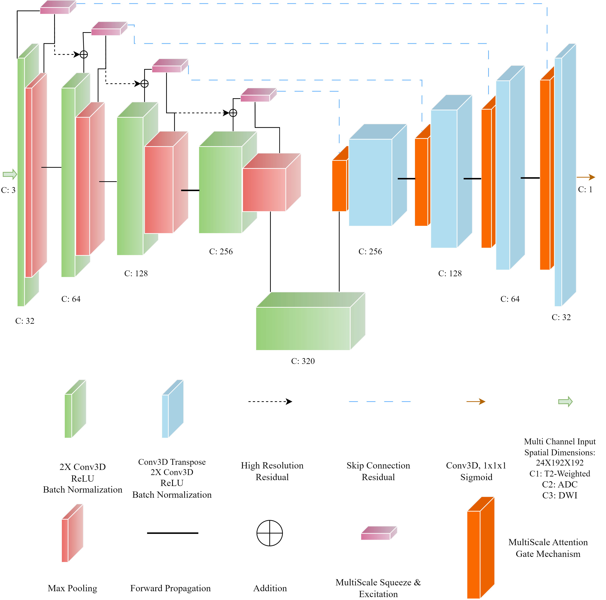
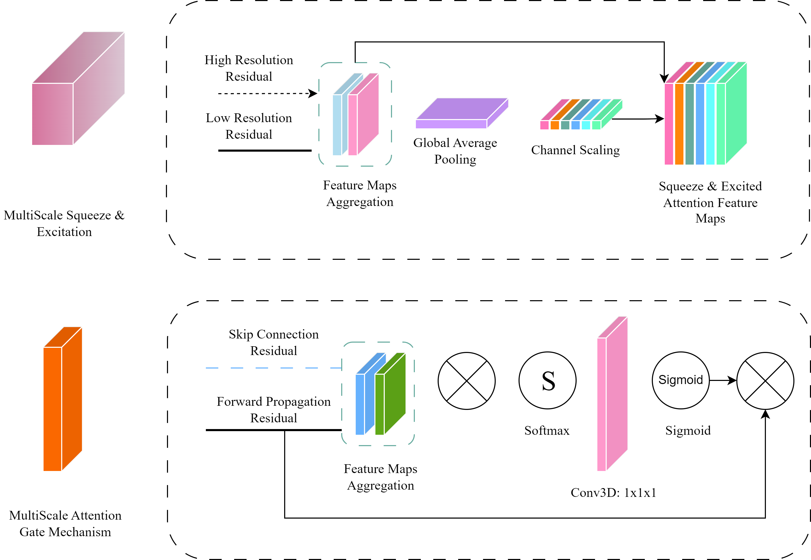

# ProLesA-Net
The current repository serves as the placeholder for the ProLesA-Net model

# Model Architecture
ProLesA-Net along with the multiscale attention mechanisms are presented below:



# Usage
```python
import tensorflow as tf
import ProlesaModule

msqa = ProlesaModule.ProLesA_Net.ProlesaNet()
msqa.build(input_shape = [1,24, 192,192,3])

msqa.summary()

Model: "prolesa_net"
_________________________________________________________________
Layer (type)                 Output Shape              Param #   
=================================================================
encoder_block (EncoderBlock) multiple                  10692     
_________________________________________________________________
encoder_block_1 (EncoderBloc multiple                  67912     
_________________________________________________________________
encoder_block_2 (EncoderBloc multiple                  711312    
_________________________________________________________________
encoder_block_3 (EncoderBloc multiple                  2839840   
_________________________________________________________________
bottleneck2 (Bottleneck2)    multiple                  4979840   
_________________________________________________________________
decoder_block (DecoderBlock) multiple                  5908737   
_________________________________________________________________
decoder_block_1 (DecoderBloc multiple                  1823873   
_________________________________________________________________
decoder_block_2 (DecoderBloc multiple                  161217    
_________________________________________________________________
decoder_block_3 (DecoderBloc multiple                  40673     
_________________________________________________________________
classifier (Classifier)      multiple                  33        
=================================================================
Total params: 16,544,129
Trainable params: 16,537,217
Non-trainable params: 6,912
```
